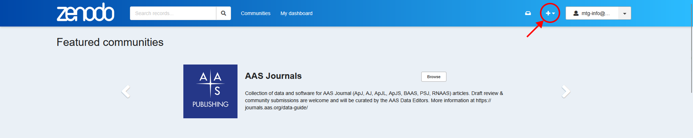
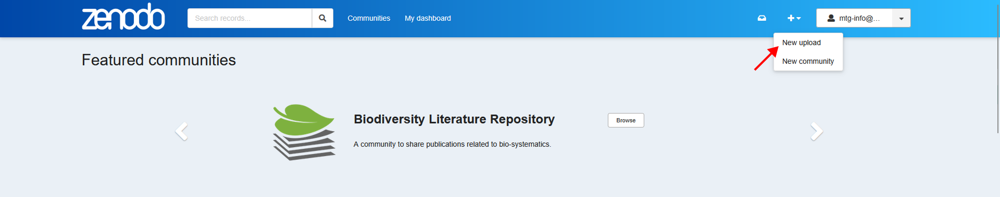
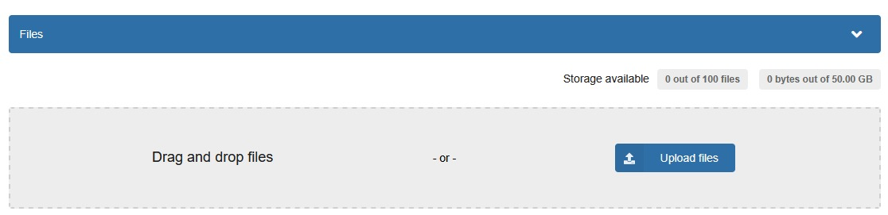
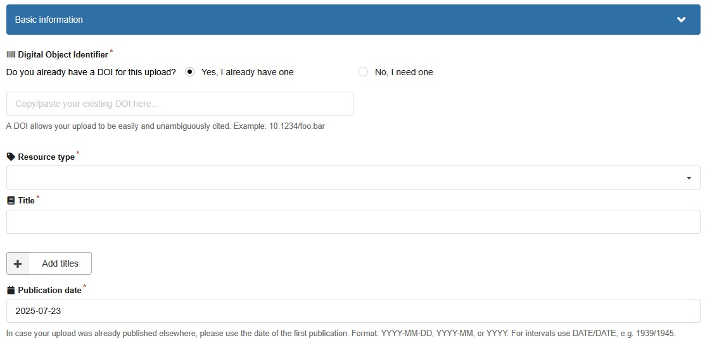
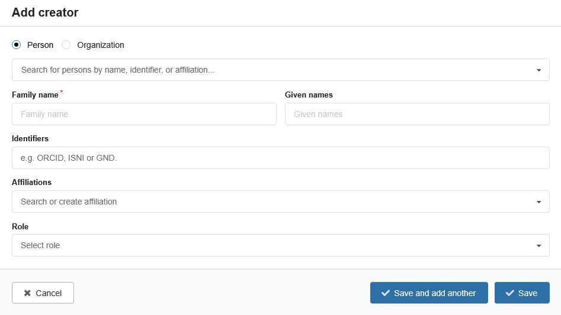
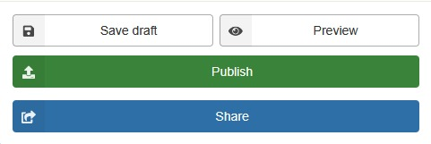

# Uploading a Dataset

> Always use mtg-info@upf.edu to upload your dataset.

1. Once you have the dataset ready, create a zip file. You can include multiple zip files.

2. Login to Zenodo and create a new record

3. Drag and drop the zip file(s) into the upload area.

4. Fill in the basic information section. Include the DOI of the paper that is associated with the dataset.

5. Add dataset curator information.
- Click on "Add Creator".
- Search for the curator's name or ORCID.
- Set the role as "Curator".

6. Include a description of the dataset.
- Provide a detailed description of the dataset, including its purpose, contents, and any relevant metadata.
- Provide the folder and annotation structure in detail.
- Provide code snippet for accessing the dataset using mirdata.
- Provide contact information (mtg-info@upf.edu)
- Include proper references format (e.g., `authorname2010`)

7. Provide additional information (optional)

8. Save and publish the record.

